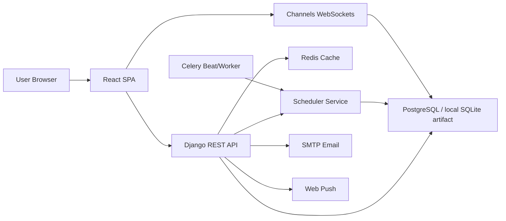

# 1 Introduction

## Application Overview

ParseOps is a multi-tenant work management platform for organizations, goals, tasks, schedules, notifications, chat, templates, notes, leave management, and analytics. The core differentiator is an automatic scheduling engine that places assigned tasks into user working intervals while respecting breaks, working days, leaves, and limited scan windows.

The application uses a Django REST backend and a React single-page frontend. Authentication is JWT-based, with OTP flows for registration and login, password reset, profile management, Microsoft OAuth stubs, and SAML-related views.

## Business Objectives

- Centralize organization/workspace management.
- Enable owners and admins to invite, approve, remove, and manage members.
- Support goal and key-result tracking with progress derived from KRs or linked tasks.
- Manage tasks with status, priority, comments, attachments, tickets, submissions, feedback, visibility, and sharing controls.
- Automatically schedule work based on assignee availability and workload.
- Provide dashboards, analytics, notifications, chat, templates, notes, and calendar views around work execution.
- Support employee working schedules and leave requests so planning reflects real availability.

## Scope

The current application scope includes:

- Authentication and user profile.
- Organizations, memberships, invitations, join requests, roles, and custom permissions.
- Goals, key results, goal visibility, sharing, and goal chat rooms.
- Task creation, updates, deletion, comments, attachments, tickets, submissions, feedback, extension requests, and scheduling.
- Queue handling for unscheduled tasks.
- Organization and user working schedules.
- Leave requests and leave balances.
- Notifications through database, websocket, email helper services, and web push subscriptions.
- Chat rooms, messages, attachments, reactions, typing, and contextual task/goal rooms.
- Templates and CSV import workflows.
- Dashboard analytics and workspace apps.
- Notes.

## Problem Statement

Teams need a system that can transform goals into scheduled work while avoiding unrealistic assignments. ParseOps addresses this by combining task management, organization context, leave tracking, user-specific working hours, and an auto-scheduler. The current repository implements much of this behavior, but it also contains duplicated scheduling utilities, partially disabled smart-suggestion endpoints, debug artifacts, and some frontend/backend route mismatches that should be formalized before production hardening.

## Technology Stack

| Layer | Technology |
|---|---|
| Backend | Python, Django 5.2, Django REST Framework |
| Auth | SimpleJWT, token blacklist, OTP verification |
| Realtime | Django Channels, Daphne, websocket consumers |
| Background jobs | Celery, Celery Beat |
| Cache/broker expectation | Redis |
| Database | PostgreSQL in settings, SQLite file present in repository |
| API schema | drf-spectacular |
| Frontend | React 19, Vite, Axios |
| UI/data libraries | FullCalendar, Recharts, lucide-react, emoji-picker-react |
| Notifications | Database notifications, websocket notifications, web push model/service |

## Architecture Overview

The backend is modularized by Django apps. The frontend is mostly a large `App.jsx` shell with supporting components for dashboard, calendar, chat, notifications, scheduler, queues, templates, extensions, and feedback.
