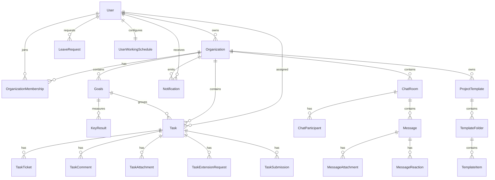

# 4 Database Documentation

## Database Configuration

Settings configure PostgreSQL database `parseops` on `127.0.0.1:5432`, while a `backend/db.sqlite3` artifact exists in the repository. Production requirements should clarify the authoritative database engine and exclude local database artifacts from source control.

## Model Catalog

### Users

| Model | Purpose | Key Fields | Relationships/Constraints |
|---|---|---|---|
| `User` | Email-authenticated user profile | `id`, `email`, name fields, online state, profile fields, scoring fields, `must_change_password` | `email` unique, custom auth user, related to memberships, tasks, goals, leaves |
| `OTPVerification` | OTP lifecycle | `phone`, `otp`, `expires_at`, `attempts`, `purpose` | Ordered newest first |
| `PasswordResetToken` | Password reset token/OTP | `user`, `token`, `otp`, `is_used`, `expires_at` | `token` unique |
| `LeaveRequest` | User leave request | `user`, `organization`, `leave_type`, `start_date`, `end_date`, `status`, `number_of_days`, attachment | Ordered newest first |
| `LeaveBalance` | Balance by leave type | `user`, `organization`, `leave_type`, `total_days`, `used_days` | Unique `(user, organization, leave_type)` |
| `UserWorkingSchedule` | User-specific work/break schedule | `work_start_time`, `work_end_time`, lunch and tea times | One-to-one with user |

### Organizations

| Model | Purpose | Key Fields | Relationships/Constraints |
|---|---|---|---|
| `Organization` | Workspace tenant | `id`, `name`, `slug`, `owner`, `is_active`, scheduling config, `timezone` | `slug` unique; default working days Mon-Fri |
| `OrganizationMembership` | User role in org | `organization`, `user`, `role`, `custom_permissions`, `is_active` | Unique `(organization, user)`; protects last active owner |
| `OrganizationJoinRequest` | Request to join workspace | `organization`, `user`, `requested_role`, `status`, review fields | Unique `(organization, user, status)` |
| `OrganizationInvitation` | Invitation by email | `organization`, `email`, `role`, `token`, `status`, `expires_at` | `token` unique |

### Goals

| Model | Purpose | Key Fields | Relationships/Constraints |
|---|---|---|---|
| `Goals` | Organizational goal | `organization`, `title`, `owner`, `progress`, `status`, `priority`, dates, visibility/sharing, parent/dependency | Unique `(title, organization)`; soft delete |
| `KeyResult` | Goal measurable result | `goal`, `title`, `target_value`, `current_value`, `unit` | Progress property; save/delete updates goal progress |

### Tasks

| Model | Purpose | Key Fields | Relationships/Constraints |
|---|---|---|---|
| `Task` | Work item | `organization`, `goal`, `title`, `assignee`, status, priority, dates, estimated/actual duration, visibility, scheduling fields, score fields | Index `task_sched_lookup_idx` on assignee/schedule/planned fields |
| `TaskComment` | Threaded task comments | `task`, `user`, `parent`, `comment`, mentions, soft delete | Chronological ordering |
| `TaskAttachment` | Task/comment file | `task`, `comment`, `file`, `file_name`, `uploaded_by` | Attached to task and optionally comment |
| `TaskTicket` | Per-assignee work ticket | `task`, `assignee`, `status`, `time_spent_minutes` | Unique `(task, assignee)` |
| `TaskExtensionRequest` | Due-date/time extension request | `task`, `requested_by`, reason, proposed date, requested hours, review fields | Ordered newest first |
| `TaskFeedback` | Completion feedback | `task`, `user`, `difficulty`, comments | Unique `(task, user)` |
| `TaskSubmission` | Proof of work | `task`, `user`, comments, file, URLs, visibility | Visibility supports all/specific/assignee+admin |

### Collaboration and Supporting Models

| Model | Purpose | Key Fields | Relationships/Constraints |
|---|---|---|---|
| `Notification` | User notification | `user`, `organization`, `title`, `message`, `notification_type`, `is_read`, `data` | Ordered newest first |
| `WebPushSubscription` | Browser push subscription | `user`, `endpoint`, keys | `endpoint` unique |
| `ChatRoom` | Direct/group/goal/task room | `organization`, `room_type`, `goal`, `task`, `created_by` | Goal/task one-to-one |
| `ChatParticipant` | Room membership | `room`, `user`, `role`, read state | Unique `(room, user)` |
| `Message` | Chat message | `room`, `sender`, `content`, file, reply, URL preview | Chronological ordering |
| `MessageReaction` | Emoji reaction | `message`, `user`, `emoji` | Unique `(message, user, emoji)` |
| `MessageAttachment` | Message attachment | `message`, `file`, metadata | File upload |
| `ProjectTemplate` | Reusable template | `organization`, `name`, `visibility`, `created_by` | Active flag |
| `TemplateFolder` | Template folder tree | `template`, `parent`, `name`, `goal_title`, `order` | Ordered |
| `TemplateItem` | Template content item | `folder`, `item_type`, content/file/url, `order` | Ordered |
| `GoalFolder` | Applied goal folder | `goal`, `parent`, `name`, `order` | Ordered |
| `GoalItem` | Applied goal item | `folder`, `item_type`, content/file/url, `order` | Ordered |
| `Note` | User/org note | `user`, `organization`, `title`, `content`, `is_active` | Ordered by update |
| `DashboardApp` | Available workspace app | `name`, `slug`, `icon`, `is_active` | `slug` unique |
| `WorkspaceApp` | Installed app | `organization`, `app`, settings | Unique `(organization, app)` |

## ER Diagram

