# 11 Sequence Diagrams

## User Login

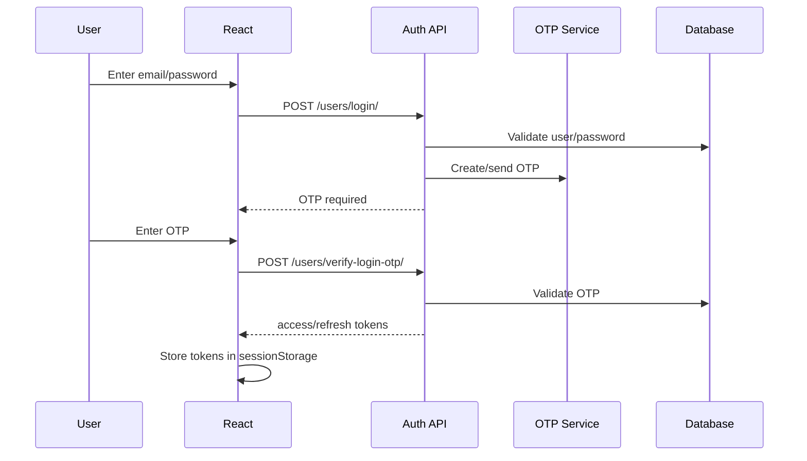

## Create Task

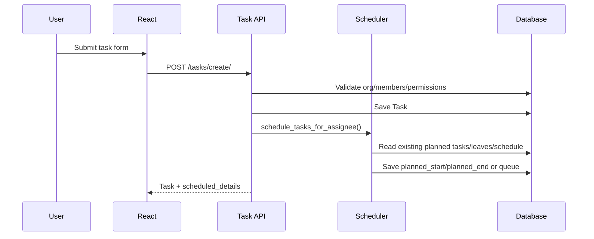

## Scheduler

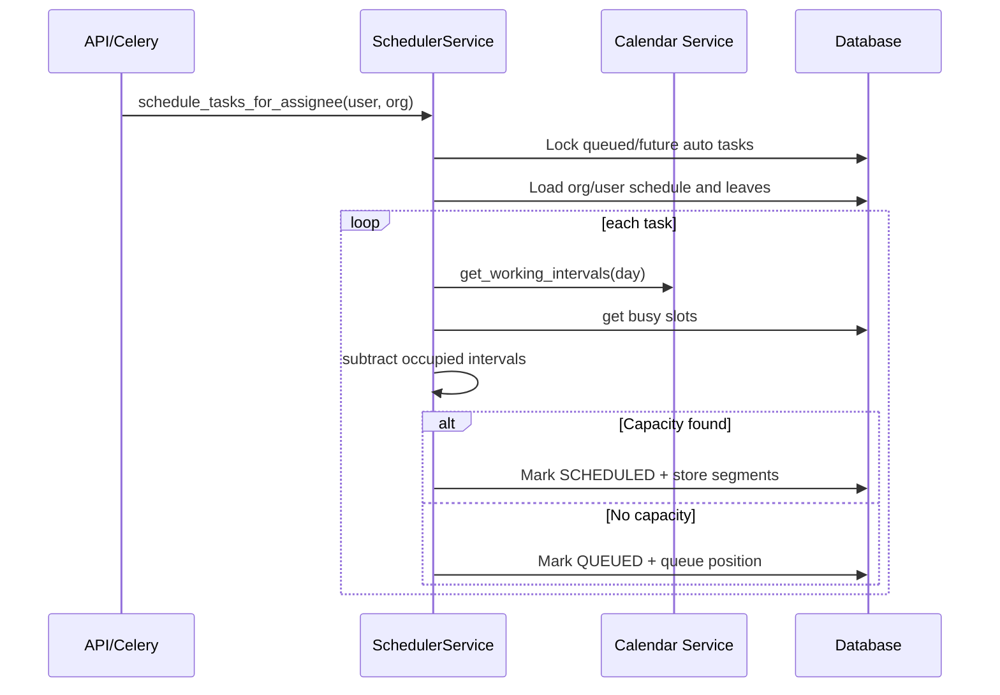

## Queue Promotion

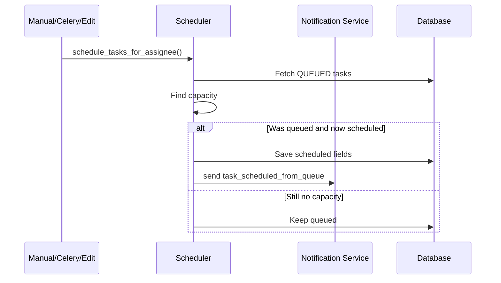

## Task Edit

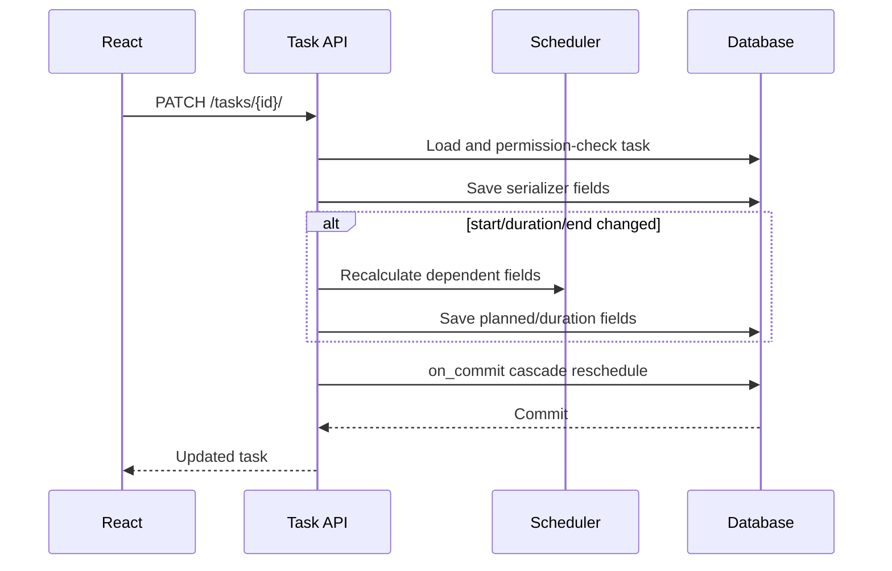

## Task Completion

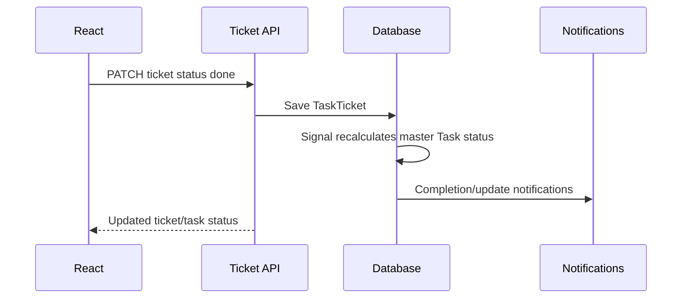

## Working Schedule Update

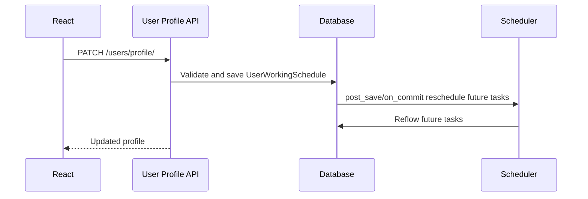

# 12 Flowcharts

## Scheduler Flow

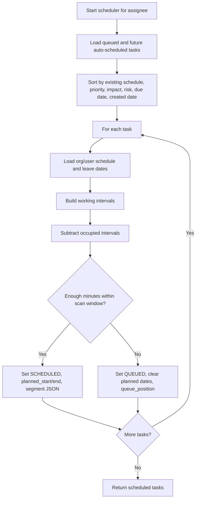

## Gap Filling

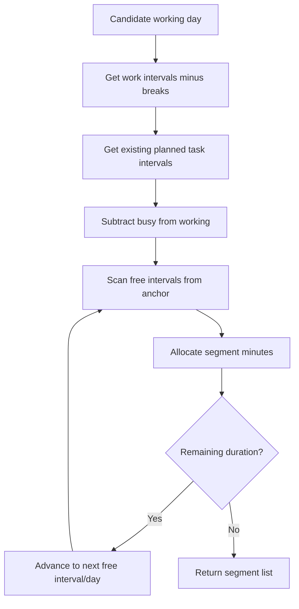

## Rescheduling

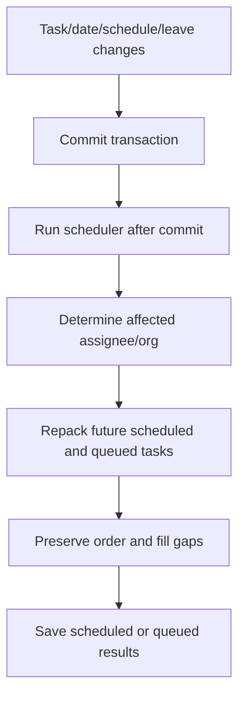

## Queue

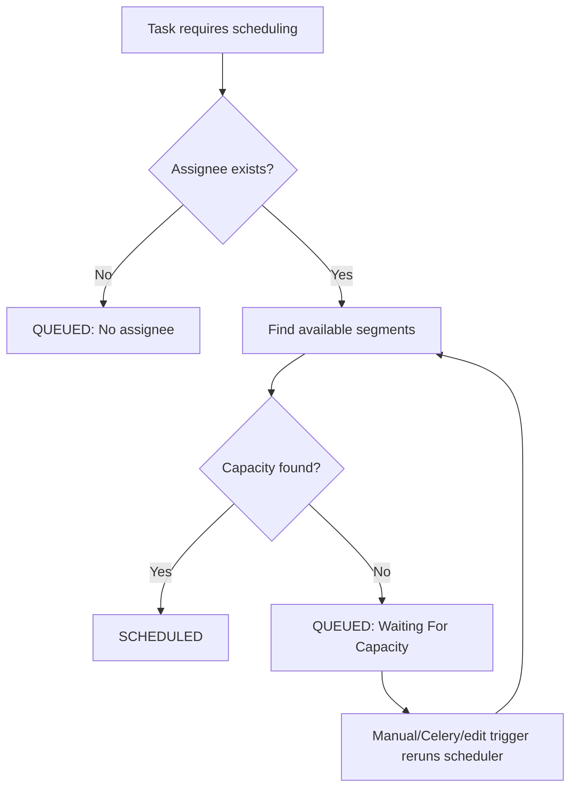
