# Enterprise Intelligent Task Scheduling System

## Software Requirements Specification (SRS)

| Item | Details |
|---|---|
| Project Name | Enterprise Intelligent Task Scheduling System / ParseOps |
| Document Type | Software Requirements Specification |
| Version | 1.0 |
| Prepared From | Existing Django REST Framework + React repository |
| Target System | Enterprise intelligent task scheduling platform |
| Prepared For | Software company, development team, internship project, future maintenance |
| Technology Stack | Django REST Framework, React, PostgreSQL, Redis, Celery, JWT Authentication |
| Documentation Scope | Reverse-engineered current system, target business requirements, missing functionality, risks, recommendations |

---

# Table of Contents

1. [Introduction](#1-introduction)  
2. [Business Objectives](#2-business-objectives)  
3. [Scope](#3-scope)  
4. [Technology Stack](#4-technology-stack)  
5. [Overall Architecture](#5-overall-architecture)  
6. [Module Overview](#6-module-overview)  
7. [Authentication](#7-authentication)  
8. [Organizations](#8-organizations)  
9. [Goals](#9-goals)  
10. [Tasks](#10-tasks)  
11. [User Working Schedule](#11-user-working-schedule)  
12. [Intelligent Scheduler](#12-intelligent-scheduler)  
13. [Progressive Scheduling](#13-progressive-scheduling)  
14. [Dynamic Rescheduling](#14-dynamic-rescheduling)  
15. [Gap Filling](#15-gap-filling)  
16. [Queue Bucket](#16-queue-bucket)  
17. [Schedule Preview](#17-schedule-preview)  
18. [Calendar](#18-calendar)  
19. [User Roles](#19-user-roles)  
20. [Database Design](#20-database-design)  
21. [API Specifications](#21-api-specifications)  
22. [Backend Design](#22-backend-design)  
23. [Frontend Design](#23-frontend-design)  
24. [Validation Rules](#24-validation-rules)  
25. [Business Rules](#25-business-rules)  
26. [Scheduler Algorithm](#26-scheduler-algorithm)  
27. [Sequence Diagrams](#27-sequence-diagrams)  
28. [Flowcharts](#28-flowcharts)  
29. [Database ER Diagram](#29-database-er-diagram)  
30. [State Diagrams](#30-state-diagrams)  
31. [Class Diagrams](#31-class-diagrams)  
32. [Test Cases](#32-test-cases)  
33. [Acceptance Criteria](#33-acceptance-criteria)  
34. [Current Bugs Found](#34-current-bugs-found)  
35. [Missing Features](#35-missing-features)  
36. [Recommended Improvements](#36-recommended-improvements)  
37. [Future Roadmap](#37-future-roadmap)  
38. [Appendix](#38-appendix)  

---

# 1 Introduction

## 1.1 Purpose

This Software Requirements Specification defines the current and target behavior of the Enterprise Intelligent Task Scheduling System. The document was generated by analyzing the existing repository and comparing the implemented system with the target business requirements supplied for user working schedules, working hours, intelligent scheduling, progressive scheduling, gap filling, dynamic rescheduling, queue behavior, and time consistency.

The goal of this document is to give future developers, maintainers, reviewers, and stakeholders a single authoritative description of the application.

## 1.2 Application Overview

The application is a multi-tenant enterprise task management and scheduling platform. It allows organizations to create workspaces, invite members, define goals, create tasks, assign work, preview schedules, automatically schedule tasks into working slots, queue tasks when capacity is unavailable, manage user working schedules, track leaves, send notifications, and display scheduled work in task lists, dashboards, and calendars.

The core differentiator is the intelligent scheduler. It is expected to calculate task placement using each assigned user's saved working schedule, respecting work hours, lunch, tea, existing tasks, leaves, holidays, and a seven-working-day capacity window. It must schedule in minutes, support long tasks by splitting work across available slots, fill gaps automatically, and keep displayed scheduling values consistent across the entire product.

## 1.3 Current Repository Summary

The repository contains:

- Django REST Framework backend.
- React frontend.
- PostgreSQL configuration.
- Redis cache configuration.
- Celery and Celery Beat scheduling.
- JWT authentication.
- Organizations, memberships, invitations, and join requests.
- Goals and key results.
- Tasks, task tickets, comments, attachments, feedback, submissions, and extension requests.
- Notifications, chat, notes, dashboard analytics, templates, CSV import.
- User working schedule and leave management.
- A scheduler implementation under `tasks/services`.
- Legacy scheduling utilities under `tasks/schedule_utils.py`.
- Frontend scheduling utilities under `frontend/src/utils/scheduleUtils.js`.

## 1.4 Definitions

| Term | Meaning |
|---|---|
| Organization | A workspace or tenant containing users, goals, and tasks |
| Member | A user belonging to an organization |
| Owner | Highest-privilege organization role |
| Admin | Elevated organization role below owner |
| Task | Work item assigned to a user and optionally linked to a goal |
| Ticket | Per-assignee execution record for a task |
| Planned Start | Datetime when scheduled work begins |
| Planned End | Datetime when scheduled work ends |
| Queue Bucket | Holding area for tasks that cannot be scheduled within the scan window |
| Working Schedule | User-specific working hours and breaks |
| Progressive Scheduling | Splitting work across multiple valid slots without losing duration |
| Gap Filling | Moving future tasks into earlier available free slots |
| Dynamic Rescheduling | Automatically recalculating affected future schedules after relevant changes |

---

# 2 Business Objectives

## 2.1 Primary Objectives

| Objective | Description |
|---|---|
| Enterprise task planning | Provide a structured workspace for goals, tasks, users, and organizations |
| Intelligent scheduling | Automatically schedule tasks using real user capacity |
| Accurate work allocation | Respect user working hours, lunch, tea, leaves, holidays, and existing work |
| Queue transparency | Queue only when no capacity exists within the next seven working days |
| Operational consistency | Keep task list, task detail, schedule preview, database, calendar, and dashboard aligned |
| Maintainability | Provide clear architecture, requirements, validation rules, workflows, and test criteria |

## 2.2 Scheduling-Specific Objectives

The scheduler must:

- Use the assigned user's permanently saved working schedule.
- Calculate all durations in minutes.
- Support input in hours, minutes, or hours plus minutes.
- Preserve full task duration across multiple slots.
- Continue work after lunch, tea, next free gaps, and following working days.
- Automatically fill earlier free gaps after changes.
- Reschedule only the affected user's future tasks.
- Queue tasks only after scanning seven working days.
- Support overnight shifts.
- Keep display values identical across all product surfaces.

## 2.3 Business Value

The system improves planning accuracy by preventing unrealistic task assignments. It gives managers visibility into capacity and gives users a reliable schedule based on actual work availability.

---

# 3 Scope

## 3.1 In Scope

- User authentication and authorization.
- Organization creation and membership management.
- Invitations and join requests.
- Goal and key result management.
- Task creation, editing, deletion, filtering, ticketing, commenting, and submission.
- User working schedule management.
- Intelligent scheduling.
- Schedule preview.
- Queue bucket.
- Dynamic rescheduling.
- Gap filling.
- Leave-aware scheduling.
- Calendar and dashboard schedule display.
- Notifications.
- API documentation.
- Backend and frontend architecture documentation.
- Current bug and missing feature identification.

## 3.2 Out of Scope

This SRS does not implement:

- New source code.
- Bug fixes.
- Database migrations.
- UI redesigns.
- Deployment changes.
- Test automation.

## 3.3 Target Business Requirements Coverage

| Business Requirement | Current Support | Gap |
|---|---|---|
| Independent user schedule | Partially supported | Persistence exists, but frontend/backend consistency needs hardening |
| Work end = work start + 10 hours | Partially supported | Model enforces in save; frontend has inconsistent 8-hour and 10-hour logic |
| Lunch/tea inside 10 hours | Supported in serializer/model | Needs stronger tests |
| Changing lunch/tea never changes work end | Mostly supported | Frontend display logic may diverge |
| Overnight shifts | Partially supported | Needs full tests and UI consistency |
| Use assigned user's schedule | Partially supported | Some calls pass membership instead of user |
| Respect holidays | Missing | Leave exists; holiday calendar does not |
| Minute calculation | Partially supported | Hours/minutes sync exists; combined hours+minutes input not formalized |
| Progressive scheduling | Supported in newer scheduler | Segment storage is mixed into `schedule_reason` |
| Gap filling | Partially supported | Needs clear policy and concurrency protection |
| Dynamic reschedule only affected user's future tasks | Partially supported | Some paths may reschedule broader sets or behave ambiguously |
| Queue after seven working days | Supported conceptually | Must validate exact working-day scan behavior |
| Time consistency across UI | Partially supported | Frontend/backend route and time conversion drift exists |

---

# 4 Technology Stack

| Layer | Technology | Current Usage |
|---|---|---|
| Backend framework | Django 5 / DRF | REST APIs, serializers, models, permissions |
| Authentication | SimpleJWT | Access/refresh tokens, token blacklist |
| Database | PostgreSQL | Configured in Django settings |
| Local artifact | SQLite | `db.sqlite3` exists and should not be production source |
| Cache | Redis / django-redis | Scheduler leave cache and general cache config |
| Background jobs | Celery / Celery Beat | Periodic auto-schedule every 30 minutes |
| Realtime | Django Channels / Daphne | Chat and notification websockets |
| Frontend | React / Vite | SPA |
| HTTP client | Axios | API wrapper and token refresh |
| Calendar | FullCalendar | Calendar-oriented UI |
| Charts | Recharts | Dashboard analytics |
| Icons | lucide-react | UI icons |
| Push | Web Push subscription model | Subscription persistence and helper |

---

# 5 Overall Architecture

## 5.1 High-Level Architecture

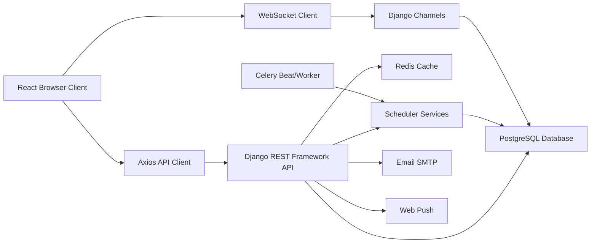

## 5.2 Backend Architecture

The backend is split into Django apps:

| App | Responsibility |
|---|---|
| `users` | User model, profile, working schedule, authentication flows, leaves |
| `organizations` | Organizations, memberships, invitations, join requests, permissions |
| `goals` | Goals, key results, goal progress, goal chat signals |
| `tasks` | Tasks, scheduler, task comments, tickets, feedback, submissions, extensions |
| `notifications` | User notifications, web push, notification websocket |
| `chat` | Chat rooms, messages, attachments, reactions, websocket |
| `dashboard` | Workspace apps |
| `analytics` | Dashboard analytics |
| `notes` | User notes |
| `project_templates` | Templates, folders, items, imports |
| `core` | Shared permissions and pagination |

## 5.3 Frontend Architecture

The frontend is a React single-page application. It uses `App.jsx` as a large central application shell and separate supporting components for dashboard, calendar, chat, templates, queue, schedule modals, notifications, feedback, and extension requests.

## 5.4 Data Flow

1. User authenticates through React UI.
2. JWT token is stored in session storage.
3. Axios sends bearer token with API requests.
4. Backend validates JWT and permissions.
5. Backend reads/writes PostgreSQL models.
6. Scheduler uses database state, user schedule, organization schedule, leaves, and existing tasks.
7. Scheduler writes planned dates or queue state.
8. React refreshes task list, details, dashboard, or calendar.

---

# 6 Module Overview

| Module | Description | Key Entities |
|---|---|---|
| Authentication | Login, registration, OTP, JWT, password reset | User, OTPVerification, PasswordResetToken |
| Organizations | Multi-tenant workspaces and membership | Organization, OrganizationMembership |
| Goals | Goal and key result tracking | Goals, KeyResult |
| Tasks | Task lifecycle and execution | Task, TaskTicket, TaskComment, TaskSubmission |
| Working Schedule | User capacity configuration | UserWorkingSchedule |
| Scheduler | Auto-planning engine | Task scheduling fields, scheduler services |
| Queue Bucket | Unschedulable task holding area | Task schedule status and queue position |
| Schedule Preview | Non-persistent scheduling estimate | Scheduler preview service |
| Calendar | Visual planned work display | Planned task fields, org calendar events |
| Notifications | User alerts | Notification, WebPushSubscription |
| Chat | Realtime communication | ChatRoom, Message, ChatParticipant |
| Leaves | Availability exceptions | LeaveRequest, LeaveBalance |
| Dashboard | Analytics and workspace overview | DashboardApp, WorkspaceApp |
| Templates | Reusable goal/project structures | ProjectTemplate, TemplateFolder, TemplateItem |
| Notes | Personal/org notes | Note |

---

# 7 Authentication

## 7.1 Current Behavior

The application uses an email-based custom user model. Username is removed. Users authenticate using email and password and complete OTP verification in the custom login flow. JWT tokens are issued and stored by the frontend.

## 7.2 Functional Requirements

| ID | Requirement |
|---|---|
| AUTH-001 | The system shall allow registration using unique email and password. |
| AUTH-002 | The system shall verify registration through OTP. |
| AUTH-003 | The system shall allow login using email and password. |
| AUTH-004 | The system shall verify login through OTP. |
| AUTH-005 | The system shall issue JWT access and refresh tokens after successful verification. |
| AUTH-006 | The system shall refresh expired access tokens using refresh tokens. |
| AUTH-007 | The system shall support logout by invalidating the refresh token. |
| AUTH-008 | The system shall support password reset using OTP/token flow. |
| AUTH-009 | The system shall support email change verification. |
| AUTH-010 | The system shall protect all organization/task/goal APIs using JWT authentication. |

## 7.3 Current API Endpoints

| Method | Endpoint | Purpose |
|---|---|---|
| POST | `/api/users/register/` | Start registration |
| POST | `/api/users/verify-registration-otp/` | Verify registration OTP |
| POST | `/api/users/login/` | Start login |
| POST | `/api/users/verify-login-otp/` | Verify login OTP |
| POST | `/api/users/logout/` | Logout |
| POST | `/api/token/refresh/` | Refresh token |
| GET/PATCH | `/api/users/profile/` | Retrieve/update profile |
| POST | `/api/users/request-email-change/` | Request email change |
| POST | `/api/users/verify-email-change/` | Verify email change |
| POST | `/api/users/forgot-password/` | Request password reset |
| POST | `/api/users/reset-password-verify/` | Verify reset OTP |

## 7.4 Security Requirements

- Passwords must be hashed using Django password hashing.
- JWT refresh tokens must be rotated and blacklisted.
- OTP attempts must be limited.
- OTP expiration must be enforced.
- Authentication errors must not leak sensitive details.
- Tokens should not be stored in insecure browser storage in production unless risk is accepted.

---

# 8 Organizations

## 8.1 Current Behavior

Organizations represent workspaces. They contain scheduling configuration, members, goals, tasks, leaves, notifications, templates, notes, and chats. Each organization has an owner and generated slug.

## 8.2 Functional Requirements

| ID | Requirement |
|---|---|
| ORG-001 | Authenticated users shall be able to create organizations. |
| ORG-002 | Organization creator shall become owner. |
| ORG-003 | Organizations shall have unique slugs. |
| ORG-004 | Organizations shall have configurable working days, breaks, timezone, and maximum scan days. |
| ORG-005 | Owners/admins shall invite users. |
| ORG-006 | Users shall request to join organizations. |
| ORG-007 | Owners/admins shall approve or reject join requests. |
| ORG-008 | Owners/admins shall manage member roles and custom permissions. |
| ORG-009 | The system shall prevent deleting or demoting the last active owner. |
| ORG-010 | Organization-scoped data shall only be visible to authorized members. |

## 8.3 Organization Scheduling Settings

| Field | Description | Default |
|---|---|---|
| `working_start_time` | Organization default work start | 10:00 |
| `working_end_time` | Organization default work end | 19:00 |
| `working_days` | Working weekdays, Monday = 0 | `[0,1,2,3,4]` |
| `lunch_break_start` | Default lunch start | 13:00 |
| `lunch_break_end` | Default lunch end | 14:00 |
| `tea_break_start` | Default tea start | 17:00 |
| `tea_break_end` | Default tea end | 17:30 |
| `additional_breaks` | Extra breaks list | `[]` |
| `maximum_scan_days` | Scheduler scan window | 7 |
| `timezone` | Organization timezone | Asia/Kolkata |

## 8.4 Organization APIs

| Method | Endpoint | Purpose |
|---|---|---|
| GET/POST | `/api/organizations/` | List/create organizations |
| GET/PATCH/DELETE | `/api/organizations/{id}/` | Retrieve/update/delete organization |
| POST | `/api/organizations/{id}/join-request/` | Submit join request |
| POST | `/api/organizations/{id}/invite/` | Invite member |
| GET | `/api/organizations/{id}/members/` | List members |
| POST | `/api/organizations/{id}/remove-member/` | Remove member |
| POST | `/api/organizations/{id}/restore-member/` | Restore member |
| POST | `/api/organizations/{id}/change-role/` | Change role |
| POST | `/api/organizations/{id}/change-permissions/` | Change permissions |
| GET | `/api/organizations/{id}/calendar-events/` | Get calendar events |

---

# 9 Goals

## 9.1 Current Behavior

Goals are organization-scoped objectives. Goals can have key results, tasks, assignees, visibility settings, sharing settings, dependencies, parent goals, and chat rooms.

## 9.2 Functional Requirements

| ID | Requirement |
|---|---|
| GOAL-001 | Users with permission shall create goals in an organization. |
| GOAL-002 | Goal names shall be unique within an organization among active/non-deleted goals. |
| GOAL-003 | Goals shall support key results. |
| GOAL-004 | Key result progress shall update goal progress. |
| GOAL-005 | Goal progress shall fall back to task completion when no key results exist. |
| GOAL-006 | Goals shall support visibility and sharing options. |
| GOAL-007 | Goal chat room shall be created automatically. |
| GOAL-008 | Goal assignees shall be synchronized with goal chat participants. |

## 9.3 Goal Statuses

| Status | Meaning |
|---|---|
| `not_started` | No measurable progress |
| `in_progress` | Progress greater than zero but less than 100 |
| `at_risk` | Risk state, currently available as choice |
| `completed` | Progress is 100 or higher |

## 9.4 Goal APIs

| Method | Endpoint | Purpose |
|---|---|---|
| GET/POST | `/api/goals/?organization={id}` | List/create goals |
| GET/PATCH/DELETE | `/api/goals/{id}/` | Goal detail/update/delete |
| POST | `/api/goals/{id}/restore/` | Restore goal |
| GET/POST | `/api/goals/{goal_id}/key-results/` | List/create key results |
| PATCH/DELETE | `/api/goals/{goal_id}/key-results/{id}/` | Update/delete key result |
| GET/POST | `/api/org/{slug}/goals/` | Slug-scoped goals |

---

# 10 Tasks

## 10.1 Current Behavior

Tasks are the main schedulable work items. A task belongs to an organization, optionally belongs to a goal, and currently has a single canonical assignee. The serializer still accepts `assignees` for backward compatibility and maps the first assignee to `assignee`.

## 10.2 Functional Requirements

| ID | Requirement |
|---|---|
| TASK-001 | Users with permission shall create tasks. |
| TASK-002 | A task shall belong to exactly one organization. |
| TASK-003 | A task may belong to a goal. |
| TASK-004 | A task shall support a single assigned user for scheduling. |
| TASK-005 | Task duration shall support hours, minutes, and combined hours/minutes. |
| TASK-006 | Task planned start/end shall be calculated by scheduler unless manually pinned. |
| TASK-007 | Task visibility shall restrict access for members. |
| TASK-008 | Owners/admins shall be able to view all organization tasks. |
| TASK-009 | Task comments, attachments, submissions, feedback, and extension requests shall be supported. |
| TASK-010 | Task ticket status shall synchronize master task status. |

## 10.3 Task Fields

| Category | Fields |
|---|---|
| Identity | `id`, `title`, `description`, `issue_type` |
| Ownership | `organization`, `goal`, `created_by`, `assignee`, `watchers` |
| Status | `status`, `priority`, `is_deleted`, `is_overdue` |
| Dates | `start_date`, `due_date`, `due_time`, `created_at`, `updated_at` |
| Duration | `estimated_hours`, `estimated_minutes`, `actual_hours`, `actual_time_spent_minutes` |
| Reminder | `reminder_preference`, `reminder_duration_minutes`, `reminder_sent` |
| Scheduling | `planned_start`, `planned_end`, `schedule_status`, `queue_position`, `is_auto_scheduled`, `schedule_reason`, `last_scheduler_run` |
| Visibility | `visibility_type`, `visible_to`, `shared_viewers`, `sharing_option` |
| Extension | `extension_count`, `is_blocked` |
| Scoring | `impact`, `risk`, `required_assignees` |

## 10.4 Task Statuses

| Status | Meaning |
|---|---|
| `backlog` | Not yet planned |
| `todo` | Ready to start |
| `in_progress` | Being worked on |
| `paused` | Temporarily paused |
| `delayed` | Delayed |
| `in_review` | Review stage |
| `testing` | Testing stage |
| `done` | Completed |

## 10.5 Task APIs

| Method | Endpoint | Purpose |
|---|---|---|
| POST | `/api/tasks/create/` | Create standalone task |
| POST | `/api/goals/{goal_id}/tasks/create/` | Create task under goal |
| GET | `/api/organizations/{org_id}/tasks/` | List visible tasks |
| GET/PATCH/PUT/DELETE | `/api/tasks/{task_id}/` | Detail/update/delete |
| PATCH | `/api/tasks/{task_id}/update-status/` | Status update |
| DELETE | `/api/tasks/{task_id}/soft-delete/` | Soft delete |
| POST | `/api/tasks/{task_id}/restore/` | Restore task |
| GET | `/api/organizations/{org_id}/tasks/filter/` | Filtered task list |
| GET | `/api/organizations/{org_id}/tasks/kanban/` | Kanban/ticket view |
| PATCH | `/api/tasks/{task_id}/change-assignee/` | Override assignee |

---

# 11 User Working Schedule

## 11.1 Target Requirement

Each user owns an independent working schedule with these fields:

- Work Start Time
- Work End Time
- Lunch Break Start
- Lunch Break End
- Tea Break Start
- Tea Break End

These values must persist permanently and survive logout, login, browser refresh, and server restart.

## 11.2 Current Implementation

The backend defines `UserWorkingSchedule` as a one-to-one model with `User`. A default schedule is created automatically when a user is created.

| Field | Current Default |
|---|---|
| `work_start_time` | 10:00 |
| `work_end_time` | 19:00, but model save recalculates as start + 10 hours |
| `lunch_break_start` | 13:00 |
| `lunch_break_end` | 14:00 |
| `tea_break_start` | 17:00 |
| `tea_break_end` | 17:30 |

## 11.3 Persistence Requirement

| Event | Expected Behavior |
|---|---|
| Logout | Schedule remains in database |
| Login | Schedule loads from database |
| Browser refresh | Frontend refetches persisted profile/schedule |
| Server restart | Schedule remains in database |
| Task scheduling | Scheduler uses saved schedule |

## 11.4 Working Duration Rule

Target business rule:

```text
Work End = Work Start + 10 hours
```

Lunch and tea must occur inside those ten hours. Changing lunch or tea must never change work end.

Current backend model mostly enforces this rule by recalculating `work_end_time` from `work_start_time`. Current frontend utilities are inconsistent: one function computes work end from 8 working hours plus breaks, while another assumes 10 hours.

## 11.5 Overnight Shift Requirement

The system must support schedules such as:

| Field | Example |
|---|---|
| Work Start | 22:00 |
| Work End | 08:00 next day |
| Lunch | 01:00-02:00 |
| Tea | 04:00-04:30 |

The scheduler should treat early-morning times as part of the previous logical working day when needed.

## 11.6 Required Validation

- Work start is required.
- Work end is derived and read-only.
- Lunch start/end are required or defaulted.
- Tea start/end are required or defaulted.
- Lunch duration must be 1-60 minutes.
- Tea duration must be 1-30 minutes.
- Lunch and tea must not overlap.
- Lunch and tea must be inside the 10-hour shift.
- Overnight break times must be normalized relative to the work start.

---

# 12 Intelligent Scheduler

## 12.1 Target Requirement

The scheduler must use the assigned user's saved working schedule and respect:

- Working hours.
- Lunch.
- Tea.
- Existing tasks.
- Leave.
- Holidays.
- Minute-level duration.
- Hours, minutes, and hours+minutes input.

## 12.2 Current Implementation

The active scheduler is implemented in:

- `tasks/services/calendar.py`
- `tasks/services/scheduler.py`
- `tasks/services/preview.py`

It supports:

- Organization timezone conversion.
- Organization working days.
- User schedule override.
- Lunch/tea/additional break subtraction.
- Approved leave dates.
- Busy slot subtraction.
- Segment accumulation.
- Queue fallback.

## 12.3 Scheduler Inputs

| Input | Source |
|---|---|
| Assignee | Task assignee |
| Organization | Task organization |
| Duration | `estimated_minutes` or `estimated_hours` |
| Start anchor | Current time, task planned start, or explicit preview start |
| Work intervals | User schedule or organization defaults |
| Existing tasks | Planned non-done tasks for assignee |
| Leave dates | Approved leave requests |
| Scan window | Organization `maximum_scan_days`, default 7 |

## 12.4 Scheduler Outputs

| Output | Description |
|---|---|
| `planned_start` | First scheduled segment start |
| `planned_end` | Last scheduled segment end |
| `schedule_status` | `SCHEDULED` or `QUEUED` |
| `queue_position` | Queue ordering number |
| `schedule_reason` | Text reason or serialized segment JSON |
| `last_scheduler_run` | Processing timestamp |

## 12.5 Holiday Gap

The target requirements mention holidays. The current repository supports leave requests but does not contain a formal holiday model or organization holiday calendar. This is a missing feature.

---

# 13 Progressive Scheduling

## 13.1 Target Requirement

The scheduler must use every available working slot and continue remaining work in later slots. It must continue across days when required and must never lose task duration.

## 13.2 Example

Assume:

- Work: 10:00-20:00
- Lunch: 13:00-14:00
- Tea: 17:00-17:30
- Task duration: 5 hours
- Start: 12:00

Expected segments:

| Segment | Time | Minutes |
|---|---|---:|
| 1 | 12:00-13:00 | 60 |
| 2 | 14:00-17:00 | 180 |
| 3 | 17:30-18:30 | 60 |
| Total |  | 300 |

The task must not end at lunch or skip remaining duration.

## 13.3 Current Support

The newer scheduler accumulates segments across free intervals. It stores those segments as JSON inside `schedule_reason` when scheduled.

## 13.4 Required Improvements

- Store segments in a dedicated JSON field or child table.
- Return segments consistently to task list, task detail, calendar, dashboard, and preview.
- Test long tasks spanning multiple days.
- Test overnight multi-segment tasks.

---

# 14 Dynamic Rescheduling

## 14.1 Target Requirement

The system must automatically reschedule only the affected user's future tasks when:

- Working hours change.
- Lunch changes.
- Tea changes.
- Estimated duration changes.
- Task is edited.
- Leave changes.
- Holiday changes.

## 14.2 Current Triggers

| Trigger | Current Behavior |
|---|---|
| User working schedule save | Calls `reschedule_user_future_tasks()` after commit |
| Leave approved/cancelled | Calls `reschedule_user_future_tasks()` after commit |
| Leave deleted | Reschedules if approved |
| Task update | Cascades affected assignee tasks after commit |
| Task delete | Reschedules affected assignee after commit |
| Celery Beat | Schedules all active members every 30 minutes |

## 14.3 Affected Scope Rule

Target behavior:

```text
Only the affected user's future tasks should be rescheduled.
```

Current implementation mostly follows this for user schedule and leave changes. Celery Beat schedules all users periodically, which is acceptable as a background maintenance job but should not replace targeted rescheduling.

## 14.4 Required Behavior

When a user's schedule changes:

1. Identify that user.
2. Identify organizations where that user has future active scheduled/queued tasks.
3. Lock only that user's relevant tasks.
4. Preserve completed/past/manual tasks.
5. Repack future auto-scheduled tasks into earliest valid slots.
6. Queue only tasks that do not fit within seven working days.

---

# 15 Gap Filling

## 15.1 Target Requirement

Whenever a task changes, the scheduler must automatically fill earlier gaps and shift later tasks forward whenever possible.

## 15.2 Current Behavior

The newer scheduler searches from the current time or anchor and subtracts occupied intervals. This allows tasks to be placed into available gaps, not only appended to the end of the timeline.

## 15.3 Example

Before:

| Task | Time |
|---|---|
| A | 10:00-12:00 |
| B | 15:00-17:00 |

If task A is shortened to end at 11:00, there is a gap from 11:00-13:00 before lunch or later. A queued one-hour task should move into the earliest available gap.

## 15.4 Required Rules

- Completed tasks must not move.
- Past tasks must not move.
- Manual pinned tasks should not move unless explicitly unlocked.
- Only affected assignee's future tasks should be considered.
- Existing chronological order should be preserved unless priority rules explicitly override it.

---

# 16 Queue Bucket

## 16.1 Target Requirement

A task should enter the queue only after scanning the next seven working days and failing to find enough capacity.

## 16.2 Current Queue Fields

| Field | Description |
|---|---|
| `schedule_status='QUEUED'` | Task is in queue |
| `queue_position` | Position in queue |
| `schedule_reason='Waiting For Capacity'` | Reason |
| `planned_start=null` | No scheduled start |
| `planned_end=null` | No scheduled end |

## 16.3 Queue Entry Reasons

| Reason | Description |
|---|---|
| No assignee | Task has not been assigned |
| Waiting For Capacity | No slot found within scan window |
| Pending initial schedule | Task saved but scheduler not completed |

## 16.4 Queue Promotion

Queued tasks should be promoted when:

- Existing future tasks are completed/deleted/shortened.
- User working hours change and capacity opens.
- Leave is cancelled.
- Manual scheduler is run.
- Celery scheduler is run.

## 16.5 Current Issues

- Queue order is not a formal product rule.
- Queue position can become stale.
- Some reschedule paths do not consistently set queue position.
- Queue history is not stored.

---

# 17 Schedule Preview

## 17.1 Purpose

Schedule preview allows frontend users to see where a task would be placed before saving or while editing.

## 17.2 Endpoint

```http
POST /api/organizations/{org_id}/tasks/schedule-preview/
```

## 17.3 Request Example

```json
{
  "assignee": "9e5a4a44-0000-0000-0000-000000000000",
  "estimated_hours": 2.5,
  "task_id": "optional-task-id",
  "start_search_from": "2026-06-25T10:00:00+05:30"
}
```

## 17.4 Response Example

```json
{
  "planned_start": "2026-06-25T10:00:00+05:30",
  "planned_end": "2026-06-25T12:30:00+05:30",
  "segments": [
    {
      "start": "2026-06-25T10:00:00+05:30",
      "end": "2026-06-25T12:30:00+05:30",
      "duration": 150
    }
  ],
  "message": "Available slot found."
}
```

## 17.5 Time Consistency Requirement

The preview result must match the final database result when the task is saved with the same inputs.

Current risk: frontend time conversion, localized ISO strings, and backend UTC storage can cause display mismatches if not consistently normalized.

---

# 18 Calendar

## 18.1 Target Requirement

The calendar must display the same scheduling values as:

- Schedule preview.
- Database.
- Task detail.
- Task list.
- Dashboard.

## 18.2 Expected Calendar Events

| Event Type | Source |
|---|---|
| Scheduled task | `Task.planned_start`, `Task.planned_end`, segments |
| Queued task | Queue bucket, optionally separate view |
| Goal date | Goal start/due dates |
| Leave | Approved leave requests |
| Holiday | Missing holiday model |

## 18.3 Calendar Requirements

- Use organization timezone.
- Show segmented tasks accurately.
- Do not show queued tasks as scheduled events.
- Update after rescheduling.
- Display overnight tasks across date boundary.

---

# 19 User Roles

## 19.1 Roles

| Role | Description |
|---|---|
| Anonymous | Not authenticated |
| Authenticated User | Logged in, not necessarily organization member |
| Member | Standard organization participant |
| Admin | Organization manager |
| Owner | Organization owner with highest privileges |
| Task Creator | User who created a task |
| Goal Owner | User responsible for a goal |
| Assignee | User assigned to execute a task |

## 19.2 Access Matrix

| Capability | Anonymous | Auth User | Member | Admin | Owner |
|---|---:|---:|---:|---:|---:|
| Register/login | Yes | Yes | Yes | Yes | Yes |
| Create organization | No | Yes | Yes | Yes | Yes |
| Join request | No | Yes | Yes | Yes | Yes |
| Invite users | No | No | No | Yes | Yes |
| Manage roles | No | No | No | Yes | Yes |
| View all org tasks | No | No | No | Yes | Yes |
| View assigned/visible tasks | No | No | Yes | Yes | Yes |
| Create task | No | No | Yes | Yes | Yes |
| Assign to owner/admin | No | No | No | Yes | Yes |
| Run own schedule | No | No | Yes | Yes | Yes |
| Run all-member schedule | No | No | No | Yes | Yes |
| Approve leave | No | No | No | Yes | Yes |
| Review extension | No | No | No | Yes | Yes |

---

# 20 Database Design

## 20.1 Core Tables

### User

| Field | Type | Notes |
|---|---|---|
| `id` | UUID | Primary key |
| `email` | Email | Unique login identifier |
| profile fields | Mixed | Name, phone, city, department, photo |
| score fields | Integer | Performance, experience, efficiency, availability |
| `must_change_password` | Boolean | Temporary password support |

### UserWorkingSchedule

| Field | Type | Notes |
|---|---|---|
| `user` | OneToOne | Each user owns one schedule |
| `work_start_time` | Time | Editable |
| `work_end_time` | Time | Derived from start + 10 hours |
| `lunch_break_start` | Time | Editable |
| `lunch_break_end` | Time | Editable/capped |
| `tea_break_start` | Time | Editable |
| `tea_break_end` | Time | Editable/capped |

### Organization

| Field | Type | Notes |
|---|---|---|
| `id` | UUID | Primary key |
| `name` | String | Workspace name |
| `slug` | Slug | Unique |
| `owner` | FK User | Owner |
| scheduling fields | Time/JSON | Org defaults |
| `maximum_scan_days` | Integer | Default 7 |
| `timezone` | String | Default Asia/Kolkata |

### Task

| Field | Type | Notes |
|---|---|---|
| `id` | UUID | Primary key |
| `organization` | FK | Required |
| `goal` | FK | Optional |
| `assignee` | FK User | Single canonical assignee |
| `estimated_hours` | Decimal | Optional |
| `estimated_minutes` | Integer | Preferred total minutes |
| `planned_start` | DateTime | Scheduler output |
| `planned_end` | DateTime | Scheduler output |
| `schedule_status` | String | `SCHEDULED`, `QUEUED`, `COMPLETED` |
| `queue_position` | Integer | Queue bucket order |
| `is_auto_scheduled` | Boolean | Scheduler control |
| `schedule_reason` | Text | Reason or segment JSON |

## 20.2 Relationship Summary

| Relationship | Cardinality |
|---|---|
| User to UserWorkingSchedule | 1:1 |
| User to OrganizationMembership | 1:N |
| Organization to OrganizationMembership | 1:N |
| Organization to Goals | 1:N |
| Organization to Task | 1:N |
| Goals to Task | 1:N |
| User to assigned Tasks | 1:N |
| Task to TaskTicket | 1:N |
| Task to TaskComment | 1:N |
| Task to TaskSubmission | 1:N |
| Task to TaskExtensionRequest | 1:N |

---

# 21 API Specifications

## 21.1 API Conventions

- Base path: `/api/`
- Authentication: `Authorization: Bearer <access_token>`
- Content type: JSON unless uploading files.
- File uploads use multipart form-data.
- Errors are currently inconsistent and may use `error`, `detail`, or serializer field errors.

## 21.2 Scheduling APIs

### Schedule Preview

| Item | Details |
|---|---|
| Method | POST |
| URL | `/api/organizations/{org_id}/tasks/schedule-preview/` |
| Auth | Required |
| Required fields | `assignee`, `estimated_hours` |
| Optional fields | `task_id`, `start_search_from` |
| Success | Planned start/end and segments |
| Failure | 400 missing/invalid estimate, 500 scheduler error |

### Manual Schedule

| Item | Details |
|---|---|
| Method | POST |
| URL | `/api/organizations/{org_id}/tasks/manual-schedule/` |
| Auth | Required |
| Permission | Member for self, admin/owner for all/users |
| Body | Optional `user_id` |
| Success | Scheduled task list |

### Run Scheduler

| Item | Details |
|---|---|
| Method | POST |
| URL | `/api/organizations/{org_slug}/tasks/run_scheduler/` |
| Auth | Required |
| Behavior | Schedules queued todo/in-progress tasks |

## 21.3 Task APIs

| Method | Endpoint | Description |
|---|---|---|
| POST | `/api/tasks/create/` | Create task |
| GET | `/api/organizations/{org_id}/tasks/` | List tasks |
| GET | `/api/tasks/{task_id}/` | Detail |
| PATCH | `/api/tasks/{task_id}/` | Update |
| PATCH | `/api/tasks/{task_id}/update-status/` | Update status |
| DELETE | `/api/tasks/{task_id}/soft-delete/` | Soft delete |
| POST | `/api/tasks/{task_id}/restore/` | Restore |
| GET | `/api/organizations/{org_id}/tasks/filter/` | Filter |
| GET | `/api/organizations/{org_id}/tasks/kanban/` | Kanban |

## 21.4 Frontend-Referenced Missing APIs

The frontend API wrapper references routes that are commented out or missing in the backend:

| Endpoint | Expected Purpose |
|---|---|
| `/organizations/{org_id}/tasks/smart-suggest/` | Smart assignee suggestions |
| `/organizations/{org_id}/tasks/check-free-members/` | Recently free members |
| `/organizations/{org_id}/tasks/assign-suggested/` | Assign suggested member |
| `/organizations/{org_id}/tasks/bulk-schedule/` | Bulk schedule |
| `/organizations/{org_id}/tasks/preview-schedule/` | Schedule preview variant |
| `/organizations/{org_id}/tasks/apply-schedule/` | Apply schedule assignments |

---

# 22 Backend Design

## 22.1 Layer Responsibilities

| Layer | Responsibility |
|---|---|
| Models | Persistent data and constraints |
| Serializers | Validation, field mapping, representation |
| Views | API request orchestration and permissions |
| Services | Business logic such as scheduler and analytics |
| Signals | Event-driven updates and notifications |
| Celery | Background scheduling |
| Channels | Realtime chat and notifications |

## 22.2 Scheduler Service Design

The scheduler service:

1. Loads assignee and organization.
2. Gets current time.
3. Finds leave dates.
4. Builds allowed working days.
5. Loads occupied planned task intervals.
6. Builds working intervals per day.
7. Subtracts occupied intervals.
8. Accumulates free segments until duration is complete.
9. Saves scheduled or queued result.

## 22.3 Signal Design

Signals perform:

- Default working schedule creation.
- Schedule rescheduling after user schedule changes.
- Schedule rescheduling after leave changes.
- Goal chat room creation.
- Goal participant synchronization.
- Task status/ticket synchronization.
- Notification generation.
- Task chat creation.

## 22.4 Background Design

Celery Beat runs `auto_schedule_all_users` every 30 minutes. It iterates active organizations and active memberships and schedules each user's tasks.

---

# 23 Frontend Design

## 23.1 Current Frontend Structure

| File/Component | Responsibility |
|---|---|
| `App.jsx` | Main app shell, view state, forms, modals, workflows |
| `api.js` | Axios client, token refresh, API wrappers |
| `scheduleUtils.js` | Frontend time calculations |
| `Dashboard.jsx` | Analytics dashboard |
| `CalendarView.jsx` | Calendar display |
| `ScheduleTasksModal.jsx` | Scheduling modal |
| `PendingQueueView.jsx` | Queue UI |
| `NotificationDropdown.jsx` | Notifications |
| `ChatLayout.jsx` | Chat |
| `TemplateManager.jsx` | Template builder/import |

## 23.2 Frontend Requirements

- Fetch persisted user schedule on profile load.
- Display work end as work start + 10 hours.
- Never recalculate work end based on lunch/tea changes.
- Use backend schedule preview as authoritative.
- Display scheduled segments consistently.
- Refresh task/calendar/dashboard after scheduler changes.
- Show queue status clearly.
- Handle access loss if user is removed from workspace.

## 23.3 Current Frontend Risks

- `App.jsx` is very large.
- Schedule calculation logic differs from backend.
- Some API wrappers point to missing endpoints.
- Token storage uses `sessionStorage`.
- No centralized server-state cache.

---

# 24 Validation Rules

## 24.1 Working Schedule Validation

| Rule | Requirement |
|---|---|
| Work start | Required |
| Work end | Derived, not manually changed by lunch/tea |
| Shift duration | 10 hours |
| Lunch duration | 1-60 minutes |
| Tea duration | 1-30 minutes |
| Break containment | Lunch and tea inside shift |
| Break overlap | Lunch and tea cannot overlap |
| Overnight | Times before work start normalize to next day |

## 24.2 Task Validation

| Rule | Requirement |
|---|---|
| Organization | Required |
| Assignee | Must be active member if supplied |
| Watchers | Must be active members |
| Visible users | Must be active members |
| Member assignment | Members cannot assign to admins/owners |
| Duplicate task title | Rejected within same goal |
| Custom reminder | Requires custom duration |
| Leave overlap | Assignee on approved leave blocks due-period assignment |
| Duration | Must sync hours and minutes |

## 24.3 Leave Validation

| Rule | Requirement |
|---|---|
| Date order | Start date must be <= end date |
| Overlap | Pending/approved overlap blocked |
| Balance | Insufficient balance rejected |
| Half day | Counts as 0.5 |
| Unpaid/WFH exclusions | May bypass balance |

---

# 25 Business Rules

## 25.1 Scheduling Business Rules

1. Every scheduled task must have one assignee.
2. The assigned user's working schedule overrides organization defaults.
3. Work end equals work start plus 10 hours.
4. Lunch and tea are non-working intervals inside the 10-hour shift.
5. Existing non-completed planned tasks occupy capacity.
6. Approved leaves remove entire leave dates from capacity.
7. Holidays must remove holiday dates from capacity when implemented.
8. Durations are calculated in minutes.
9. Long tasks can be split across valid slots.
10. A task enters queue only after seven working days are scanned.
11. Future affected tasks must be dynamically rescheduled after schedule-affecting changes.
12. Completed tasks must not move.
13. Manual pinned tasks should not move unless explicitly unlocked.

## 25.2 Visibility Business Rules

1. Owners/admins can view all organization tasks.
2. Members can view tasks assigned to them.
3. Members can view tasks they created.
4. Members can view organization-visible tasks.
5. Members can view tasks where they are watchers, visible users, or shared viewers.
6. Specific visibility should include creator and management users.

## 25.3 Organization Business Rules

1. Each organization must have at least one active owner.
2. A user may only have one active membership per organization.
3. Pending invitations expire.
4. Join requests require review.

---

# 26 Scheduler Algorithm

## 26.1 Target Algorithm

```text
Input:
  assignee_id
  organization_id
  task_duration_minutes
  start_search_from
  exclude_task_id optional

Steps:
  1. Load organization.
  2. Load assigned user.
  3. Load user's saved working schedule.
  4. Calculate work_end = work_start + 10 hours.
  5. Normalize lunch and tea inside the 10-hour shift.
  6. Load approved leaves and holidays.
  7. Build next seven working days.
  8. For each working day:
       a. Build working intervals.
       b. Subtract lunch, tea, extra breaks.
       c. Subtract existing planned active tasks.
       d. Allocate available minutes to task.
       e. Continue until remaining minutes = 0.
  9. If all minutes allocated:
       save planned_start, planned_end, segments, status SCHEDULED.
 10. Else:
       clear planned dates, status QUEUED, set queue reason.
```

## 26.2 Duration Handling

| Input | Conversion |
|---|---|
| 2 hours | 120 minutes |
| 90 minutes | 90 minutes |
| 1 hour 30 minutes | 90 minutes |
| empty duration | Default 60 minutes, if business accepts default |

## 26.3 Segment Calculation Example

Task duration: 8 hours  
User work: 22:00-08:00  
Lunch: 01:00-02:00  
Tea: 04:00-04:30  

| Segment | Time | Minutes |
|---|---|---:|
| 1 | 22:00-01:00 | 180 |
| 2 | 02:00-04:00 | 120 |
| 3 | 04:30-07:30 | 180 |
| Total |  | 480 |

---

# 27 Sequence Diagrams

## 27.1 User Login

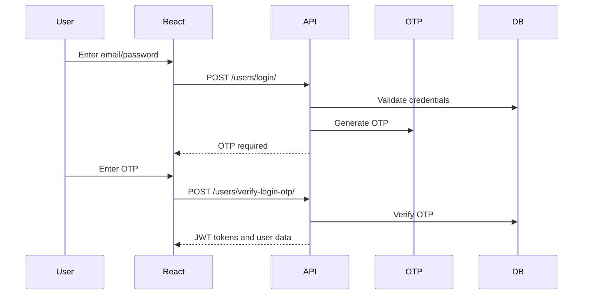

## 27.2 Create Task and Schedule

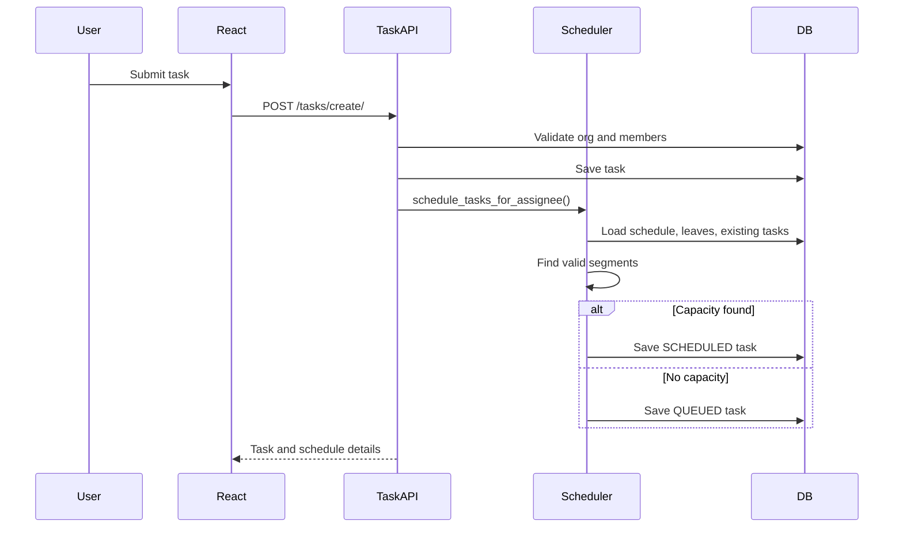

## 27.3 Schedule Preview

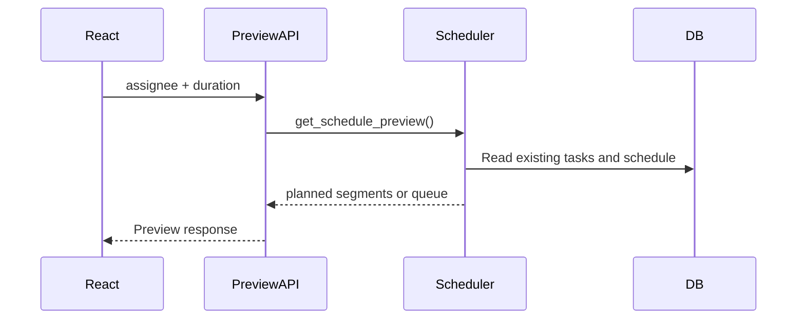

## 27.4 Working Schedule Update

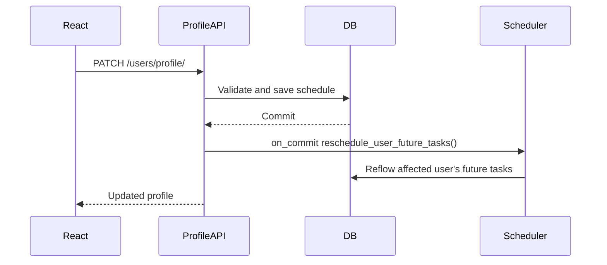

## 27.5 Leave Approval Rescheduling

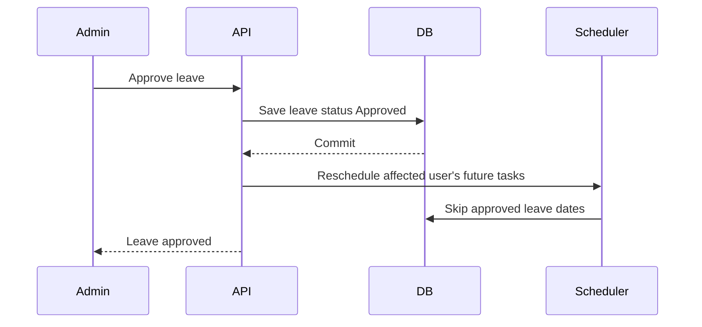

---

# 28 Flowcharts

## 28.1 Scheduler Flowchart

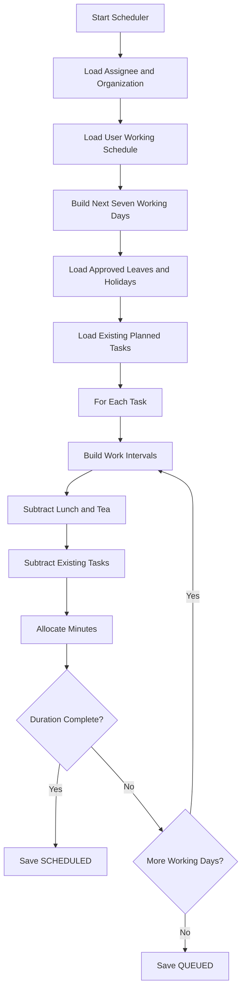

## 28.2 Dynamic Rescheduling Flowchart

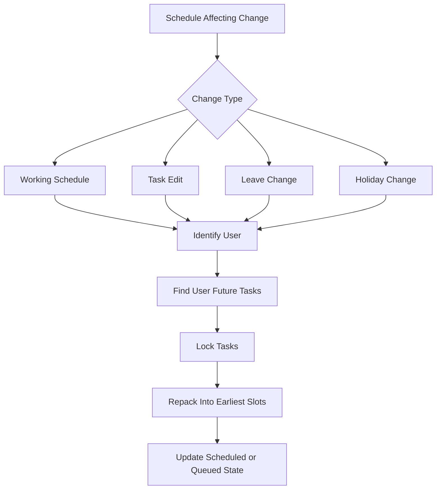

## 28.3 Queue Flowchart

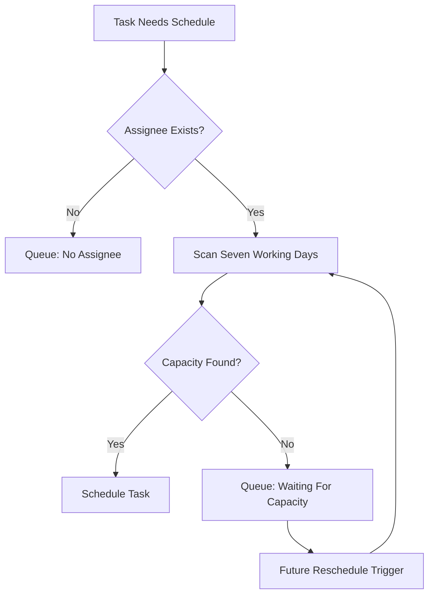

---

# 29 Database ER Diagram

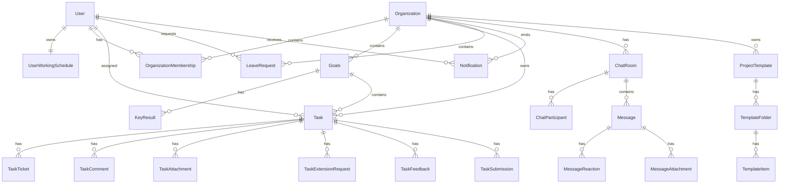

---

# 30 State Diagrams

## 30.1 Task State

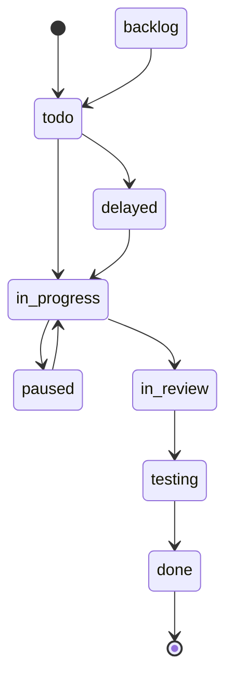

## 30.2 Schedule State

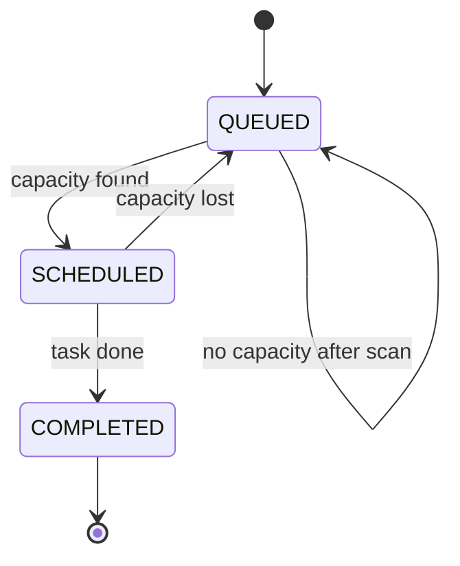

## 30.3 Leave State

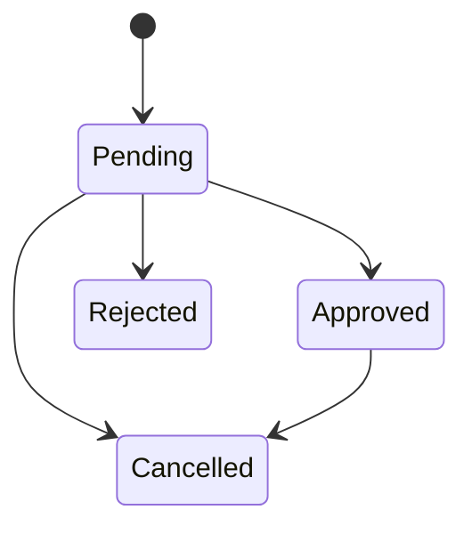

## 30.4 Extension Request State

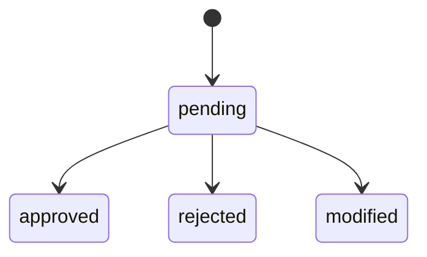

---

# 31 Class Diagrams

## 31.1 Scheduler Class Diagram

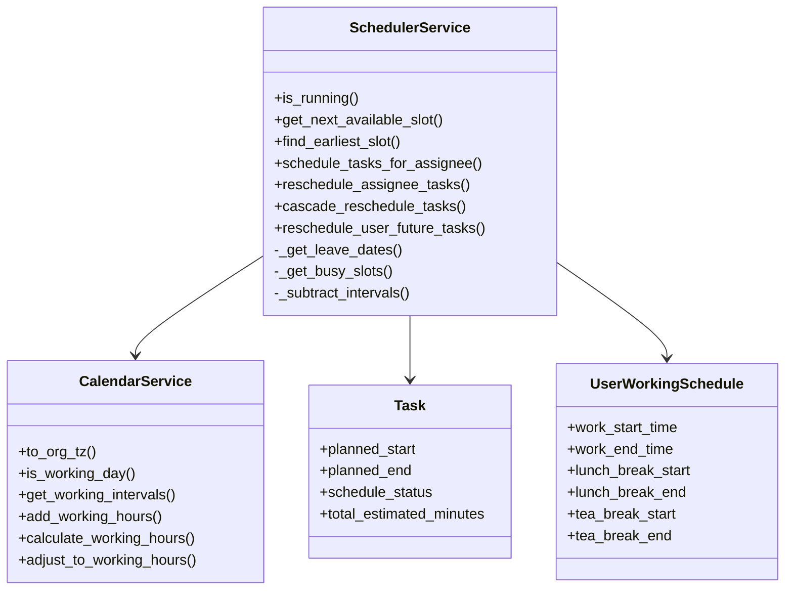

## 31.2 Domain Class Diagram

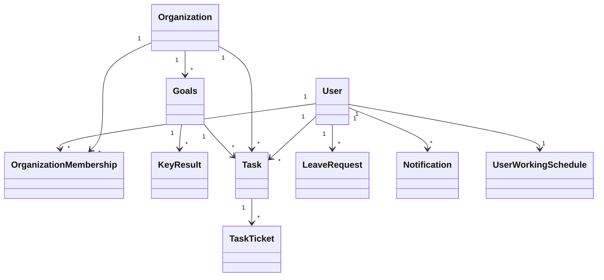

---

# 32 Test Cases

## 32.1 Working Schedule Tests

| ID | Scenario | Expected Result |
|---|---|---|
| WS-001 | Create new user | Default working schedule is created |
| WS-002 | Update work start to 09:00 | Work end becomes 19:00 |
| WS-003 | Change lunch from 13:00 to 14:00 | Work end remains unchanged |
| WS-004 | Lunch duration exceeds 60 minutes | Validation error |
| WS-005 | Tea duration exceeds 30 minutes | Validation error |
| WS-006 | Lunch overlaps tea | Validation error |
| WS-007 | Work start 22:00 | Work end becomes next-day 08:00 |
| WS-008 | Logout/login after schedule update | Same schedule is returned |

## 32.2 Scheduler Tests

| ID | Scenario | Expected Result |
|---|---|---|
| SCH-001 | 2-hour task, empty day | Scheduled at earliest valid slot |
| SCH-002 | Task crosses lunch | Segment resumes after lunch |
| SCH-003 | Task crosses tea | Segment resumes after tea |
| SCH-004 | Task longer than day capacity | Continues next working day |
| SCH-005 | Existing task blocks slot | Scheduler uses next free slot |
| SCH-006 | Gap exists before later task | Scheduler fills gap |
| SCH-007 | User on leave | Leave date skipped |
| SCH-008 | Holiday exists | Holiday skipped after feature is implemented |
| SCH-009 | No capacity in 7 working days | Task queued |
| SCH-010 | Overnight shift task | Schedules across midnight |
| SCH-011 | Estimated minutes only | Uses exact minute duration |
| SCH-012 | Hours + minutes input | Converts to exact minutes |

## 32.3 Dynamic Rescheduling Tests

| ID | Scenario | Expected Result |
|---|---|---|
| DRS-001 | Working start changes | Only affected user's future tasks move |
| DRS-002 | Lunch changes | Future tasks avoid new lunch |
| DRS-003 | Tea changes | Future tasks avoid new tea |
| DRS-004 | Estimated duration increases | Later tasks shift as needed |
| DRS-005 | Task shortened | Later task fills earlier gap |
| DRS-006 | Leave approved | Affected user's future tasks skip leave |
| DRS-007 | Leave cancelled | Queued tasks may be promoted |

## 32.4 API Tests

| ID | Scenario | Expected Result |
|---|---|---|
| API-001 | Missing schedule preview estimate | 400 error |
| API-002 | Invalid estimate value | 400 error |
| API-003 | Non-member assignee | 400 error |
| API-004 | Member assigns task to owner | 403 error |
| API-005 | Private task accessed by unrelated member | 403 error |
| API-006 | Removed member requests org data | 403/404 and frontend access-lost behavior |

## 32.5 UI Tests

| ID | Scenario | Expected Result |
|---|---|---|
| UI-001 | Refresh browser after schedule update | Schedule persists |
| UI-002 | Create task and preview schedule | Preview matches saved task |
| UI-003 | Open task detail | Planned values match task list |
| UI-004 | Open calendar | Calendar values match task detail |
| UI-005 | Dashboard task metrics | Uses same scheduled values |

---

# 33 Acceptance Criteria

## 33.1 Working Schedule

- Each user has exactly one persisted working schedule.
- Work end is always work start plus 10 hours.
- Lunch and tea changes do not change work end.
- Lunch and tea remain inside the 10-hour shift.
- Overnight shifts are valid.
- Profile API returns the saved schedule after login and refresh.

## 33.2 Intelligent Scheduler

- Scheduler uses assigned user's saved schedule.
- Scheduler respects lunch and tea.
- Scheduler respects existing planned tasks.
- Scheduler respects approved leaves.
- Scheduler respects holidays after holiday module exists.
- Scheduler calculates in minutes.
- Scheduler preserves full duration across segments.
- Scheduler queues only after seven working days are scanned.

## 33.3 Dynamic Rescheduling

- Working schedule changes reschedule only affected user's future tasks.
- Task edits reschedule only affected user's future tasks.
- Leave changes reschedule only affected user's future tasks.
- Completed and past tasks are not moved.
- Manual pinned tasks are not moved unless explicitly unlocked.

## 33.4 Time Consistency

- Schedule preview and saved database values match for same inputs.
- Task list and task detail display same planned values.
- Calendar and dashboard display same planned values.
- All displays use organization timezone consistently.

---

# 34 Current Bugs Found

## 34.1 Scheduler Bugs and Risks

| ID | Issue | Impact |
|---|---|---|
| BUG-SCH-001 | `reschedule_subsequent_tasks()` wrapper references missing `SchedulerService.reschedule_subsequent_tasks` method | Runtime failure if called |
| BUG-SCH-002 | Create flow sets `is_auto_scheduled=False` when planned fields are supplied but still calls auto scheduler | Manual pinned task behavior may be wrong |
| BUG-SCH-003 | `schedule_reason` stores both text and JSON segments | Hard to query and maintain |
| BUG-SCH-004 | Some calendar calls appear to pass membership instead of user | User schedule overrides may not apply |
| BUG-SCH-005 | Queue position not consistently set in all reschedule paths | Queue ordering may be stale |
| BUG-SCH-006 | Legacy `shift_datetime_working_minutes()` returns snapped original datetime instead of shifted datetime | Incorrect legacy calculations |
| BUG-SCH-007 | Frontend 8-hour-plus-break schedule logic conflicts with 10-hour business rule | UI/backend mismatch |

## 34.2 API Bugs and Risks

| ID | Issue | Impact |
|---|---|---|
| BUG-API-001 | Schedule preview writes debug logs to an absolute local path | Portability and security issue |
| BUG-API-002 | Frontend references missing/commented backend routes | UI actions can fail |
| BUG-API-003 | Error shapes are inconsistent | Frontend handling complexity |

## 34.3 Security Bugs and Risks

| ID | Issue | Impact |
|---|---|---|
| BUG-SEC-001 | Hard-coded secret key and email credentials in settings | Production security risk |
| BUG-SEC-002 | `DEBUG=True` and `CORS_ALLOW_ALL_ORIGINS=True` | Unsafe for production |
| BUG-SEC-003 | JWT stored in session storage | XSS token exposure risk |
| BUG-SEC-004 | `MEDIA_ROOT=BASE_DIR` | Uploads can mix with source tree |

---

# 35 Missing Features

| Feature | Requirement Source | Status |
|---|---|---|
| Holiday calendar | Business requirements | Missing |
| Dedicated schedule segment storage | Progressive scheduling | Missing |
| Hours + minutes explicit task input | Business requirements | Not formalized |
| Manual schedule lock/unlock policy | Scheduling consistency | Missing |
| Queue history/audit | Enterprise maintainability | Missing |
| Scheduler run audit table | Observability | Missing |
| Consistent frontend/backend time source | Time consistency | Partial |
| Smart suggestions backend routes | Frontend references | Missing/commented |
| Bulk schedule/apply schedule backend routes | Frontend references | Missing/commented |
| Dedicated route/page architecture | Maintainability | Missing |

---

# 36 Recommended Improvements

## 36.1 Scheduler Improvements

- Consolidate all scheduling into the backend service scheduler.
- Remove or deprecate legacy scheduler utilities.
- Add `TaskScheduleSegment` model or JSON field.
- Make `schedule_reason` text-only.
- Add per-assignee scheduler locks.
- Add exhaustive scheduler tests.
- Implement holiday calendar model.
- Fix missing method wrapper.
- Enforce manual pinned task policy.

## 36.2 Backend Improvements

- Move secrets to environment variables.
- Remove debug file writes.
- Standardize API errors.
- Complete OpenAPI schema examples.
- Add pagination to large endpoints.
- Add indexes for scheduler and dashboard queries.
- Remove local database and scratch files from repository.

## 36.3 Frontend Improvements

- Split `App.jsx` into route/page modules.
- Use backend preview as authoritative.
- Remove duplicate scheduling calculations or mark as display-only.
- Add centralized server-state cache.
- Normalize time display using organization timezone.
- Remove API wrappers for missing endpoints or implement backend routes.

## 36.4 Database Improvements

- Add dedicated holiday table.
- Add schedule segment storage.
- Add scheduler run log table.
- Add queue audit table if enterprise reporting is required.
- Add schema validation for JSON permission fields.

---

# 37 Future Roadmap

## Phase 1: Stabilization

- Secure settings.
- Remove debug artifacts.
- Fix scheduler method mismatch.
- Standardize time handling.
- Add scheduler tests.

## Phase 2: Scheduling Completeness

- Add holiday calendar.
- Add task schedule segments.
- Implement manual lock policy.
- Formalize queue ordering.
- Add scheduler audit logs.

## Phase 3: Enterprise UX

- Refactor frontend into pages/modules.
- Add calendar segment visualization.
- Add queue management dashboard.
- Add manager scheduling controls.
- Add notifications for schedule changes.

## Phase 4: Advanced Intelligence

- Smart assignee suggestion.
- Workload balancing.
- Fatigue scoring.
- Skills-based assignment.
- Predictive delay detection.
- SLA and capacity forecasting.

---

# 38 Appendix

## 38.1 Important Backend Files

| File | Purpose |
|---|---|
| `backend/users/models.py` | User, working schedule, leave models |
| `backend/users/serializers.py` | Profile and working schedule validation |
| `backend/organizations/models.py` | Organization and membership models |
| `backend/tasks/models.py` | Task, tickets, comments, scheduling fields |
| `backend/tasks/views.py` | Task APIs and scheduling endpoints |
| `backend/tasks/services/calendar.py` | Working interval calculations |
| `backend/tasks/services/scheduler.py` | Main scheduler |
| `backend/tasks/services/preview.py` | Schedule preview |
| `backend/tasks/schedule_utils.py` | Legacy scheduling utilities |
| `backend/config/celery.py` | Celery Beat schedule |
| `backend/tasks/celery_tasks.py` | Periodic auto scheduling |

## 38.2 Important Frontend Files

| File | Purpose |
|---|---|
| `frontend/src/App.jsx` | Main frontend application |
| `frontend/src/api.js` | API client and wrappers |
| `frontend/src/utils/scheduleUtils.js` | Frontend schedule calculations |
| `frontend/src/components/CalendarView.jsx` | Calendar |
| `frontend/src/components/ScheduleTasksModal.jsx` | Scheduler UI |
| `frontend/src/components/PendingQueueView.jsx` | Queue UI |
| `frontend/src/components/Dashboard.jsx` | Dashboard analytics |

## 38.3 Glossary

| Term | Definition |
|---|---|
| Capacity | Available working minutes after subtracting breaks, leaves, holidays, and existing tasks |
| Segment | One continuous scheduled portion of a task |
| Queue Bucket | Tasks waiting for capacity |
| Affected User | User whose task/schedule/leave/holiday changed |
| Future Task | Scheduled/queued task that has not completed and is not in the past |
| Manual Pinned Task | Task whose schedule was explicitly set by user and should not move automatically |

## 38.4 Final Assessment

The repository contains a strong foundation for an enterprise intelligent scheduling system. The most important existing capability is the newer scheduler service, which already supports user schedules, working intervals, breaks, approved leaves, busy-slot subtraction, segmented allocation, and queue fallback. The largest gaps are holiday support, schedule segment persistence, frontend/backend scheduling consistency, formal manual pinning behavior, missing frontend-referenced APIs, and production hardening.

To meet the full target business requirements, the project should prioritize scheduler correctness, time consistency, and removal of duplicate scheduling logic before adding advanced intelligence features.
